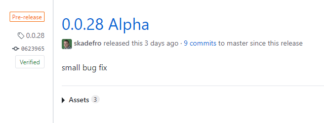
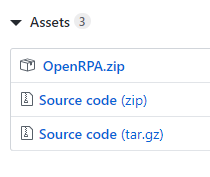
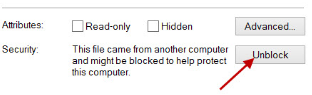
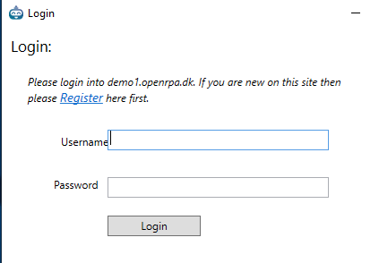
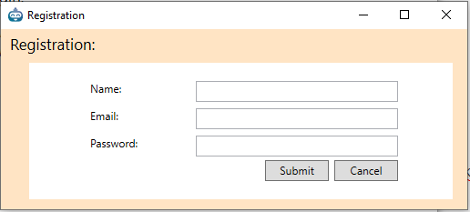

# Download

Du kan hente den nyeste version af robooten på [dette link](https://github.com/open-rpa/openrpa/releases)

Øverst vil du finde den seneste version, klik på Assets og derefter på zip filen	

Efter du har downloaded og udpakket zip filen, kan du eksekvere OpenRPA.exe ( hvis windows brokker sig over filen er downloadet fra internettet, hvilket den jo er, så skal du fjerne blokeringen ved at højre klikke på OpenRPA.exe og vælge un-block)

Først gang du starter robotten vil den forsøge at logge på OpenRPA's demo miljø.

Da du jo er en ukendt bruger skal du starte med at registere en ny konto ved at klikke på "Register" linket.

Her efter kan du du logge ind, og begynde at bruge robotten. Se evt et eksempel på nogle workflows du kan prøve og lave i denne video.

